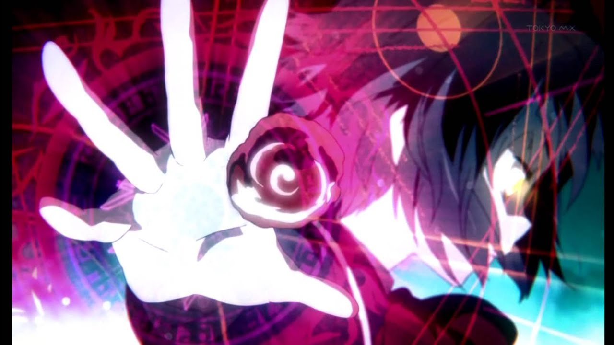
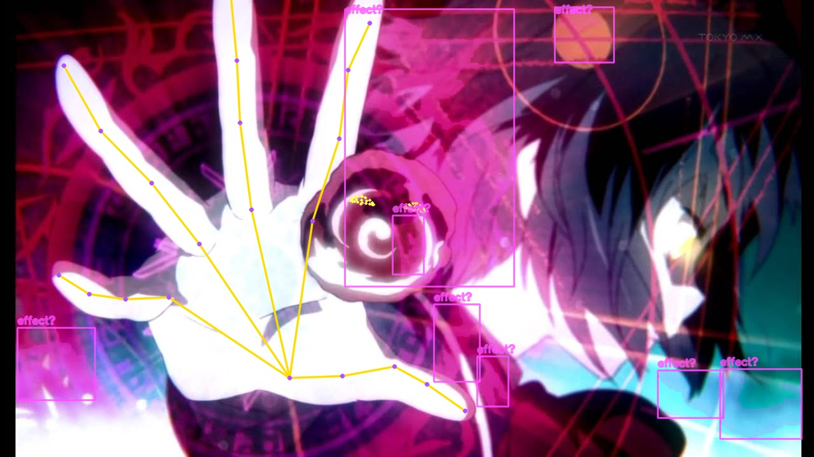

# Anime Effect Cosplaying

Turn anime hand-sign sequences into live, pose-triggered effects.

The camera watches your hand poses in order. CLIP automatically decides which
poses deserve an effect, then the effect follows your hand, face, eyes, or the
whole frame.

<p align="center">
  
</p>

## See It Work

<table>
  <tr>
    <th>Original anime frame</th>
    <th>What the tracker sees</th>
  </tr>
  <tr>
    <td></td>
    <td></td>
  </tr>
</table>

## Summon It

Python 3.10+ is recommended.

```bash
git clone https://github.com/nhanle-19/Anime_Effect_Cosplaying.git
cd Anime_Effect_Cosplaying

python3 -m venv .venv
source .venv/bin/activate
python -m pip install -r requirements.txt
python download_models.py
```

Analyze an image:

```bash
python track_image.py input/3.jpg
```

Run the live pose sequence with automatic VLM effect selection:

```bash
python -m pip install -r requirements-vlm.txt
python track_actual.py --vlm-effect-match --effects-dir effects
```

Press `Q` or `Esc` to stop.

## Make Your Own Sequence

Put one clear hand pose in each image. Number the files in casting order:

```text
my_sequence/
  01_ready.jpg
  02_focus.png
  03_fireball.png
```

Effect poses should visibly contain the effect you want. Clean poses should not.
The VLM maps each image to an effect or `none`; no manual frame mapping is
needed.

```bash
python track_actual.py \
  --input-dir my_sequence \
  --vlm-effect-match \
  --effects-dir effects
```

## Add Effects

Create one folder per animated effect. PNG frames are played in filename order:

```text
effects/
  fire_circle/
    effect.json
    fire-00001.png
    fire-00002.png
    fire-00003.png
  galaxy_ball/
    effect.json
    galaxy-00001.png
    galaxy-00002.png
```

Use RGBA PNGs with transparent backgrounds. Add optional metadata to control
where the effect appears:

```json
{
  "description": "a fiery magic circle around a hand",
  "attachment": "hand"
}
```

Attachments: `hand`, `eyes`, `face`, or `frame`.

Effect assets are intentionally ignored by Git because animation libraries can
be huge and may have separate licenses.

## Useful Spells

```bash
# Test on a video
python track_actual.py --video clip.mp4 --no-mirror \
  --vlm-effect-match --effects-dir effects -o output/demo.mp4

# Make pose matching more forgiving
python track_actual.py --vlm-effect-match --effects-dir effects \
  --pose-tolerance 0.25

# Always use one effect instead of VLM matching
python track_actual.py --effect-dir effects/fire_circle

# Analyze every frame of a video
python track_video.py input/clip.mp4
```

Use `python track_actual.py --help` for every option.

## The Magic Behind It

- MediaPipe tracks live hands and faces.
- YOLO + RTMPose analyze reference images and offline media.
- CLIP visually matches pose images to effect libraries.
- Procrustes pose matching tolerates movement, scale, rotation, and reflection.

The repository stays small: `download_models.py` fetches and verifies the
required runtime models after cloning.
